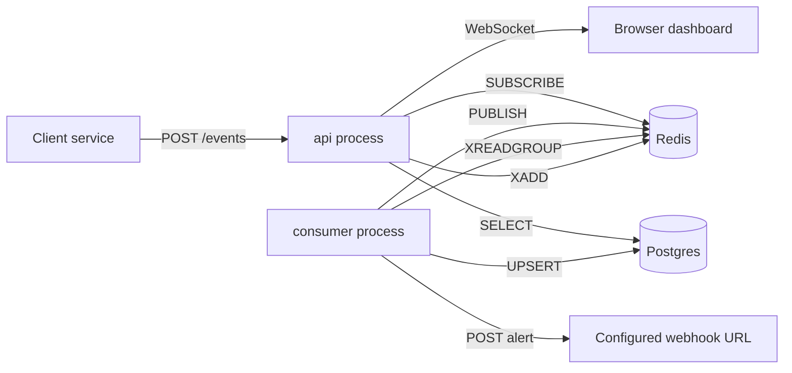
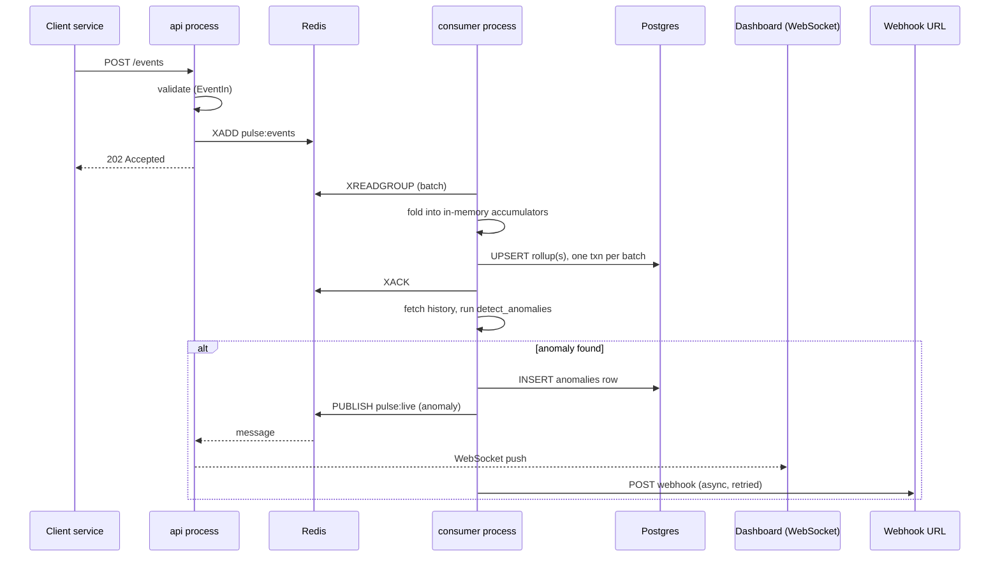
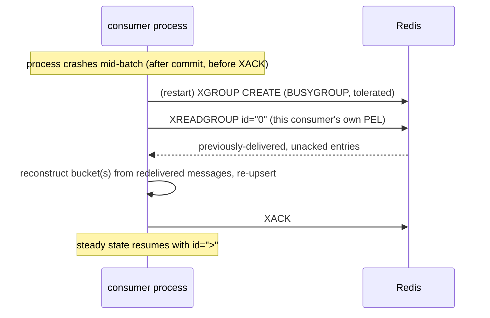

# Architecture

This document goes deeper than the README's overview: the exact data flow, the
consumer-group mechanics, the schema, failure recovery, and the scalability limits of
the current design.

## Contents

- [High-level architecture](#high-level-architecture)
- [Fast path](#fast-path)
- [Slow path](#slow-path)
- [Redis Streams and consumer groups](#redis-streams-and-consumer-groups)
- [Aggregation](#aggregation)
- [Anomaly detection](#anomaly-detection)
- [Dashboard and live updates](#dashboard-and-live-updates)
- [Database schema](#database-schema)
- [Deployment topology](#deployment-topology)
- [Failure recovery](#failure-recovery)
- [Data flow (sequence diagrams)](#data-flow-sequence-diagrams)
- [Tradeoffs](#tradeoffs)
- [Scalability](#scalability)

## High-level architecture

Pulse is two long-running OS processes plus two pieces of infrastructure, all started
by one `docker compose up`:



`api` and `consumer` are independent processes (independent Docker images, independent
restart policies) connected only by Redis and Postgres — neither calls the other
directly. This is a deliberate split, not an accident of how the code happened to be
organized: a slow consumer, a Postgres hiccup, or a webhook endpoint timing out can
never add latency to `POST /events`, because there is no code path between them at
request time.

## Fast path

`api/main.py`'s `POST /events` handler:

1. FastAPI validates the request body against `EventIn` (`schemas.py`) — the sole
   trust boundary for untrusted client input. `strict=True` Pydantic validation
   rejects type coercion (e.g. `"200"` is not accepted for `status_code`), `ts` is
   rejected if it is more than a minute in the future (catches garbage/malicious
   timestamps without being fragile to normal clock skew), and there is no upper bound
   on how far in the *past* `ts` may be — deliberately, since this is what lets
   `benchmark/run.py` and `scripts/seed_sample_data.py` backfill historical warmup data
   through the real API rather than seeding Postgres directly.
2. On success, the handler calls `XADD` on the configured Redis Stream and returns
   `202 Accepted` with the stream entry ID.
3. If Redis is unreachable or the call errors, the handler raises `HTTPException(503)`
   — the event is never silently dropped and never accepted without being durably
   buffered first.

No database write, no aggregation, and no detection logic run in this path. Structured
request logging (method, path, status, latency) is implemented as a raw ASGI
middleware — not `@app.middleware("http")` / `BaseHTTPMiddleware` — because
`BaseHTTPMiddleware` buffers the request body through an internal `anyio` stream,
which was measured to add latency to POST-with-body requests specifically.

## Slow path

`consumer/main.py` runs one coroutine, `_run_async`, for the process's lifetime:

1. **Startup**: construct the Redis/Postgres clients, `Base.metadata.create_all()`
   (the consumer is the sole schema owner — the API never creates tables), then
   `XGROUP CREATE` the consumer group (idempotent — tolerates `BUSYGROUP`).
2. **Pending drain**: `XREADGROUP` with `id="0"` for this consumer's own name, which
   returns only entries previously delivered to it but never acknowledged — this is
   what makes a restart after a crash resume correctly instead of silently abandoning
   in-flight work (see [Failure recovery](#failure-recovery)).
3. **Steady state**: loop `XREADGROUP` with `id=">"` (new entries only), batched up to
   `STREAM_BATCH_SIZE`, blocking up to `STREAM_BLOCK_TIMEOUT_MS`. Each batch:
   - is parsed and folded into in-memory `(minute_bucket, service, endpoint)`
     accumulators (raw latency samples + error count);
   - has every touched bucket's rollup upserted into Postgres in **one transaction per
     batch** (not one transaction per bucket — batches typically touch 1–3 buckets, so
     this saves round trips at zero correctness cost, since the batch is only acked
     once every touched bucket succeeds anyway);
   - only then is `XACK`ed;
   - each touched bucket is then run through [anomaly detection](#anomaly-detection),
     which is best-effort and never blocks the ack that already happened.
4. Buckets more than `AGGREGATION_WINDOW_SECONDS + BUCKET_EVICTION_GRACE_SECONDS` old
   are evicted from memory every poll cycle, bounding memory to the events currently
   held across open + grace-period buckets — proportional to recent event volume, not
   to the number of distinct buckets ever seen.
5. Consumer-group lag/backlog is sampled and both logged and published to the
   dashboard once per poll cycle (whether or not that cycle had any messages).

## Redis Streams and consumer groups

A Stream is an append-only log; a **consumer group** adds a shared, server-tracked
read cursor plus a **pending entries list (PEL)** per consumer — Redis remembers which
entries were delivered to which named consumer and have not yet been acknowledged.
This is the mechanism that makes crash recovery correct: `XREADGROUP id="0"` replays
exactly this consumer's own outstanding PEL, in delivery order, before it reads
anything new.

This was chosen over a plain list-based queue (`LPUSH`/`BRPOP`) specifically because a
plain list has no PEL — once a worker pops an entry, Redis has no record it was ever
delivered, so a crash mid-processing loses it silently. It was chosen over Kafka
because consumer groups give the same durability/replay guarantee without adding a
JVM-based broker (and, in Kafka's case, historically Zookeeper) as a second piece of
infrastructure to operate.

## Aggregation

`consumer/aggregator.py` is pure functions, no I/O: `bucket_for(ts, window_seconds)`
truncates a timestamp to its minute bucket, `is_error(status_code)` defines the 5xx
rule, and `compute_rollup(latencies, error_count)` computes `request_count`,
`error_count`, and exact `p50`/`p95`/`p99` (via `numpy.percentile`) from the raw
per-event samples held in memory for that bucket.

Percentiles are **never** computed by combining other percentiles — every reported
percentile in Pulse is computed once, directly from the raw sample it describes. This
is why the read API's `/services` and `/endpoints` list endpoints report only
additive fields (`request_count`, `error_count`) and no percentile: averaging or
summing per-bucket p95 values across endpoints or across time does not produce a
mathematically valid combined p95. Only `/services/{service}/metrics` exposes
percentiles, one row per minute per endpoint, unmerged.

Upserts use Postgres's `ON CONFLICT (minute_bucket, service, endpoint) DO UPDATE` —
each batch's rollup for a bucket **replaces** that bucket's stored row rather than
being merged with it, because the in-memory accumulator for an already-open bucket
already contains every sample seen so far for that bucket in this process's lifetime;
re-upserting is idempotent by construction, not an approximation.

## Anomaly detection

`detector/` is a pure, dependency-free package (no I/O, no `core/config.py` import) —
every function takes plain scalar parameters and returns `Finding` objects, which is
what makes it independently unit-testable to >90% coverage. `consumer/detection.py` is
the I/O boundary: it fetches history from Postgres, calls `detector.fusion.detect_anomalies`,
and persists any findings.

Three detectors run per touched bucket, fused by flagging on **any** firing:

- **Rolling z-score** (`detector/statistical.py`) — how many standard deviations the
  current value is from the mean of the last `MIN_HISTORY_BUCKETS` buckets. Cheap,
  explainable, and evaluated independently for p95 latency and error rate.
- **EWMA** (exponentially weighted moving average) — the same idea with a smoothed,
  recency-weighted baseline (`EWMA_ALPHA`) instead of a flat window mean.
- **IsolationForest** (`detector/ml.py`, scikit-learn) — run over the full multivariate
  feature vector (`request_count`, `error_count`/error rate, `p50`, `p95`, `p99`
  together), catching anomalies that are only unusual as a *combination* of features,
  not any single one spiking alone. It requires a separate, higher minimum history
  (`ISOLATION_FOREST_MIN_HISTORY`, default 30 vs. 10 for the statistical detectors) —
  found empirically during Phase 4 testing (n=10 demonstrably missed an obvious
  injected spike that z-score/EWMA both caught), not assumed from theory.

Every `Finding` carries a `detector` (always one of the three fixed values, matching
the schema) and a `reason` string stating in plain language which signal fired and by
how much — an anomaly row is never just a bare score.

**Known false-positive/false-negative characteristics** (see
[Benchmark results](../README.md#benchmark-results) for the measured numbers this
predicts and confirms):
- A purely adaptive rolling baseline "forgets" a sustained outage after roughly one
  window's worth of buckets, since the elevated values become the new normal —
  not caught without an absolute-threshold detector (see [Future improvements](../README.md#future-improvements)).
- Gradual drift is, by the same mechanism, absorbed rather than flagged — a
  change-point detector or seasonality-aware baseline would be needed to catch it.
- Low-request-volume endpoints produce noisier percentile estimates per bucket, which
  widens the statistical detectors' effective false-positive rate — this is the
  specific, confirmed cause of the benchmark's measured 12.5% precision at 100% recall.
- Detection currently runs once per **batch that touches a bucket**, not once per
  bucket-close. Confirmed live during Phase 5 testing: a single anomalous burst that
  happened to span two Redis batches produced near-duplicate (correctly non-deduped,
  genuinely distinct DB rows) anomaly entries for what is really one anomalous minute.

## Dashboard and live updates

`dashboard/index.html` is a single static file with no build step, served by the API
at `/`. On connect, `GET /ws` sends one `{"type": "snapshot", ...}` bootstrap message
(current service tiles from a `list_services` query), then incremental messages as
they happen:

- `metric_point` — one bucket's rollup, sent once per touched bucket per batch. Carries
  a monotonically increasing `sequence` number (per consumer process) so a client can
  discard stale/out-of-order messages — Pub/Sub gives no ordering guarantee across a
  reconnect.
- `anomaly` — one flagged finding, carrying its DB-assigned `id` so a reconnecting
  client can deduplicate against what the bootstrap snapshot might already include.
- `lag` — consumer-group backlog/lag, published once per consumer poll cycle.

Every message carries a `schema_version` field (`core/protocol.py`,
`LIVE_UPDATES_SCHEMA_VERSION`) so a client can detect a breaking protocol change. That
constant lives in `core/` specifically because both `api` (which sends the snapshot)
and `consumer` (which sends everything else) need it, and `core/` is the one package
both Docker images actually copy — a constant defined in `consumer/` would import fine
in local dev (every file present in the working directory) but fail at runtime inside
the `api` container, which never receives a copy of `consumer/`.

The bridge from the consumer (which produces these messages) to connected browsers
(which the consumer process has no direct connection to) is **Redis Pub/Sub**, not
Streams — a deliberate, different guarantee level from the ingestion path. Pub/Sub is
at-most-once and has no persistence: a dashboard update that's missed because a client
was briefly disconnected is not replayed, and that's fine, because the source of truth
for anything the dashboard shows is always Postgres via the read API — a missed live
update just means the view is stale until the next periodic re-fetch or reconnect,
never wrong or lost. Using Streams for this instead would add durability the use case
doesn't need at the cost of every dashboard client needing its own consumer-group
bookkeeping.

## Database schema

```sql
metrics
-------
id             bigint PK
minute_bucket  timestamptz
service        text
endpoint       text
request_count  int
error_count    int
p50            double precision
p95            double precision
p99            double precision
  UNIQUE (minute_bucket, service, endpoint)   -- uq_metrics_bucket: upsert target,
                                               -- also serves bare time-range queries
  INDEX (service, minute_bucket)              -- ix_metrics_service_bucket: serves
                                               -- exact-service + time-range queries

anomalies
---------
id             bigint PK
minute_bucket  timestamptz
service        text
endpoint       text
detector       text   -- 'zscore' | 'ewma' | 'isolation_forest'
score          double precision
reason         text
created_at     timestamptz
  INDEX (service, minute_bucket)              -- ix_anomalies_service_bucket
```

Both indexes were chosen and verified with `EXPLAIN ANALYZE` against ~220k rows, not
assumed a priori — a third index, on `(service, endpoint, minute_bucket)`, was tried on
the theory it would help `GET /endpoints`' `GROUP BY`, measured, found unused (Postgres
preferred a `HashAggregate` over the existing service+bucket index regardless), and
removed — an unused index is pure write-path cost, not a hedge worth keeping "just in
case." `anomalies` has no foreign key to `metrics` by design: an anomaly can reference
a bucket even when written in a separate transaction from that bucket's rollup.

## Deployment topology

Four services under `docker-compose.yml`: `postgres:16`, `redis:7`, `api`, `consumer`
— each with a healthcheck, `api`/`consumer` gated on `postgres`/`redis` reporting
healthy. A fifth, `benchmark`, is gated behind Compose's `profiles: ["benchmark"]` so
it is invisible to the default `docker compose up`/`ps` and only reachable via
`docker compose --profile benchmark run --rm benchmark` — a multi-minute load test must
never fire by accident. See `docs/DEPLOY.md` for cloud deployment (Railway, Render).

`docker/Dockerfile.api` copies only `api/`, `core/`, `db/`, `dashboard/`, and
`schemas.py` — never `consumer/`. `docker/Dockerfile.consumer` copies `consumer/`,
`detector/`, `core/`, `db/`, and `schemas.py` — never `api/` or `dashboard/`. This
asymmetry is why any code shared by both processes must live in `core/`, `db/`, or
`schemas.py` — a real bug this project hit once (the `schema_version` protocol
constant) and fixed by relocating the constant rather than special-casing the import.

## Failure recovery

- **Consumer crash/restart**: the pending-drain step (above) replays exactly this
  consumer's own unacknowledged entries before reading anything new. At-least-once,
  with one documented, bounded gap: if the process crashes between a bucket's Postgres
  commit and the `XACK` for that same batch, the redelivered replay reconstructs that
  bucket from only the redelivered messages (the in-memory sample from before the
  crash is gone) and re-upserts — which can under-represent that one bucket by at most
  one batch's worth of events. Closing this completely would require a durable
  per-bucket watermark (a schema change) or a transactional outbox; tracked as a named
  future improvement rather than silently worked around.
- **Redis unavailable**: `POST /events` fails closed with `503` rather than accepting
  and silently dropping data. The consumer's steady-state loop catches `RedisError`,
  logs, sleeps, and retries rather than crashing.
- **Postgres unavailable**: batch upserts retry with linear backoff
  (`POSTGRES_MAX_RETRIES` / `POSTGRES_RETRY_BACKOFF_SECONDS`); if all retries are
  exhausted, the batch is not acked and is redelivered on the next attempt (or the next
  process restart's pending-drain) rather than being lost.
- **Webhook endpoint unavailable**: webhook delivery is a fire-and-forget background
  task, retried independently with exponential backoff, tracked in a
  `background_tasks` set so in-flight tasks aren't garbage-collected mid-flight — never
  allowed to block acking or detection.
- **API process restart**: stateless beyond in-process WebSocket client tracking;
  reconnecting dashboard clients get a fresh bootstrap snapshot.

## Data flow (sequence diagrams)

**Ingest → aggregate → detect → notify:**



**Crash recovery on consumer restart:**



## Tradeoffs

| Decision | Chosen | Rejected | Why |
|---|---|---|---|
| Message broker | Redis Streams | Kafka | Same durability/replay guarantee via consumer groups, without a JVM broker to operate |
| Process topology | Two processes, one repo | True microservices | Nothing here needs independent scaling/deployment yet; two processes already isolates the fast path from slow-path latency |
| Delivery guarantee | At-least-once, bounded gap | Exactly-once | Exactly-once needs a durable watermark or transactional outbox — out of scope for the fixed schema |
| Percentile storage | Exact, computed once, never merged | Approximate/mergeable (t-digest) | Correctness first at this scale; approximation is a named future improvement once memory becomes the bottleneck |
| Live updates transport | Redis Pub/Sub (at-most-once) | Redis Streams (at-least-once) | Dashboard staleness is harmless (Postgres is the source of truth); a second per-client consumer group is unneeded overhead |
| Request middleware | Raw ASGI | `BaseHTTPMiddleware` | Measured latency cost on POST-with-body from `BaseHTTPMiddleware`'s internal body buffering |
| WebSocket update shape | Incremental per-bucket messages | Full-snapshot rebroadcast | Full-snapshot is dramatically more bandwidth for the same information as the dashboard scales |

## Scalability

The current design's real limits, in the order they'd likely be hit:

1. **Detection frequency scales with batch arrival, not with bucket count.** Detection
   runs once per batch that touches a bucket. At low-to-moderate event volume this is
   cheap; as monitored-endpoint count grows, this is the first thing that gets
   wasteful, and is also the source of the confirmed near-duplicate-anomaly-row
   behavior described above. Debouncing to once-per-bucket-close is a named future
   improvement.
2. **Consumer memory is O(events currently held in open + grace-period buckets)**, not
   O(bucket count) — proportional to recent event volume in that window. At very high
   per-bucket cardinality (many distinct endpoints, each accumulating raw latency
   samples simultaneously), this is a real, bounded-for-now scaling limit. The
   production fix — a streaming percentile approximation (t-digest/HDRHistogram)
   instead of holding every raw sample — is a named future improvement, not silently
   substituted in place of the exact percentiles this project's design otherwise
   insists on.
3. **Offset-based pagination** (`GET /services`, `GET /endpoints`) has O(offset) scan
   cost. Fine at the row counts this project has measured against; cursor-based
   pagination is a named future improvement if that stops being true.
4. **Single consumer process.** `CONSUMER_NAME` and consumer groups support running
   multiple named consumers in the same group, each getting a disjoint share of the
   stream — the mechanism scales horizontally without a code change, but running more
   than one instance has not been exercised or benchmarked here.
